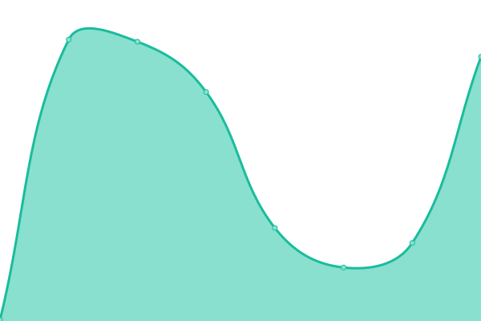

# [📈 Live Status](https://demo.upptime.js.org): <!--live status--> **🟩 All systems operational**

This repository contains the open-source uptime monitor and status page for [Upptime](https://upptime.js.org), powered by [Upptime](https://github.com/upptime/upptime).

With [Upptime](https://upptime.js.org), you can get your own unlimited and free uptime monitor and status page, powered entirely by a GitHub repository. We use [Issues](https://github.com/upptime/upptime/issues) as incident reports, [Actions](https://github.com/mhoycss/statusjefa/actions) as uptime monitors, and [Pages](https://demo.upptime.js.org) for the status page.

<!--start: status pages-->
<!-- This summary is generated by Upptime (https://github.com/upptime/upptime) -->
<!-- Do not edit this manually, your changes will be overwritten -->
<!-- prettier-ignore -->
| URL | Status | History | Response Time | Uptime |
| --- | ------ | ------- | ------------- | ------ |
|  [Jefa.io Site](https://jefa.io) | 🟩 Up | [jefa-io-site.yml](https://github.com/mhoycss/statusjefa/commits/HEAD/history/jefa-io-site.yml) | 

 451ms
     
 | 

<a href="https://status.jefa.tech/history/jefa-io-site">100.00%</a>
    

|  [Jefa Api](https://api.jefa.io/swagger-ui.html) | 🟩 Up | [jefa-api.yml](https://github.com/mhoycss/statusjefa/commits/HEAD/history/jefa-api.yml) | 

 236ms
     
 | 

<a href="https://status.jefa.tech/history/jefa-api">100.00%</a>
    

|  [Dashboard](https://dashboard.jefa.io) | 🟩 Up | [dashboard.yml](https://github.com/mhoycss/statusjefa/commits/HEAD/history/dashboard.yml) | 

 261ms
     
 | 

<a href="https://status.jefa.tech/history/dashboard">100.00%</a>
    

|  [Jefa MX Site](http://jefa.mx) | 🟩 Up | [jefa-mx-site.yml](https://github.com/mhoycss/statusjefa/commits/HEAD/history/jefa-mx-site.yml) | 

 278ms
     
 | 

<a href="https://status.jefa.tech/history/jefa-mx-site">100.00%</a>
    

|  [Banco Jefa MX Site](http://bancojefa.mx) | 🟩 Up | [banco-jefa-mx-site.yml](https://github.com/mhoycss/statusjefa/commits/HEAD/history/banco-jefa-mx-site.yml) | 

 180ms
     
 | 

<a href="https://status.jefa.tech/history/banco-jefa-mx-site">100.00%</a>
    

|  [Banco Jefa.co Site](http://bancojefa.co) | 🟩 Up | [banco-jefa-co-site.yml](https://github.com/mhoycss/statusjefa/commits/HEAD/history/banco-jefa-co-site.yml) | 

 147ms
     
 | 

<a href="https://status.jefa.tech/history/banco-jefa-co-site">100.00%</a>
    

|  [Banco Jefa.com Site](http://bancojefa.com) | 🟩 Up | [banco-jefa-com-site.yml](https://github.com/mhoycss/statusjefa/commits/HEAD/history/banco-jefa-com-site.yml) | 

 167ms
     
 | 

<a href="https://status.jefa.tech/history/banco-jefa-com-site">100.00%</a>
    

|  [Banco conjefa.co Site](http://conjefa.co) | 🟩 Up | [banco-conjefa-co-site.yml](https://github.com/mhoycss/statusjefa/commits/HEAD/history/banco-conjefa-co-site.yml) | 

 154ms
     
 | 

<a href="https://status.jefa.tech/history/banco-conjefa-co-site">100.00%</a>
    

|  [Banco conjefa.com Site](http://conjefa.com) | 🟩 Up | [banco-conjefa-com-site.yml](https://github.com/mhoycss/statusjefa/commits/HEAD/history/banco-conjefa-com-site.yml) | 

 198ms
     
 | 

<a href="https://status.jefa.tech/history/banco-conjefa-com-site">100.00%</a>
    

<!--end: status pages-->

[**Visit our status website →**](https://demo.upptime.js.org)

## 📄 License

- Powered by: [Upptime](https://github.com/upptime/upptime)
- Code: [MIT](./LICENSE) © [Upptime](https://upptime.js.org)
- Data in the `./history` directory: [Open Database License](https://opendatacommons.org/licenses/odbl/1-0/)
